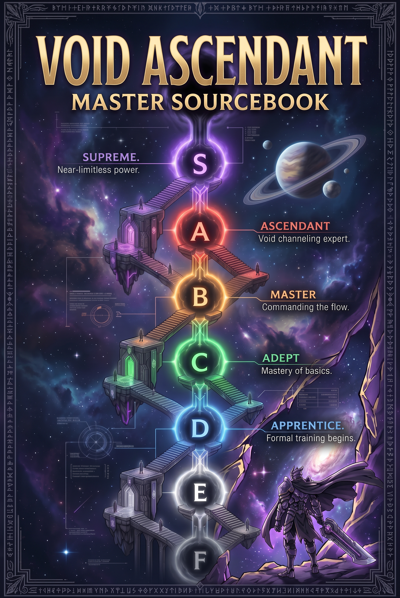
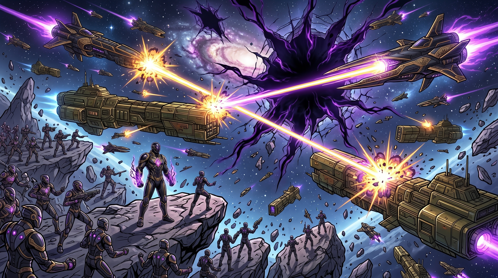
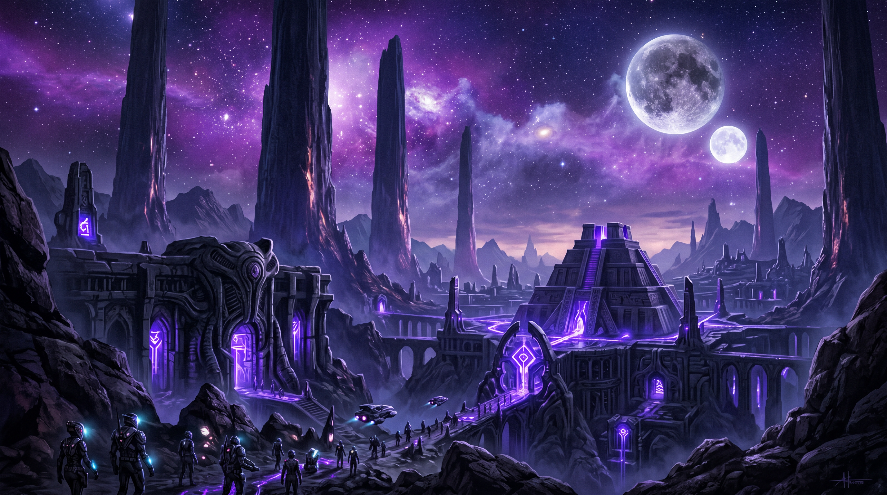
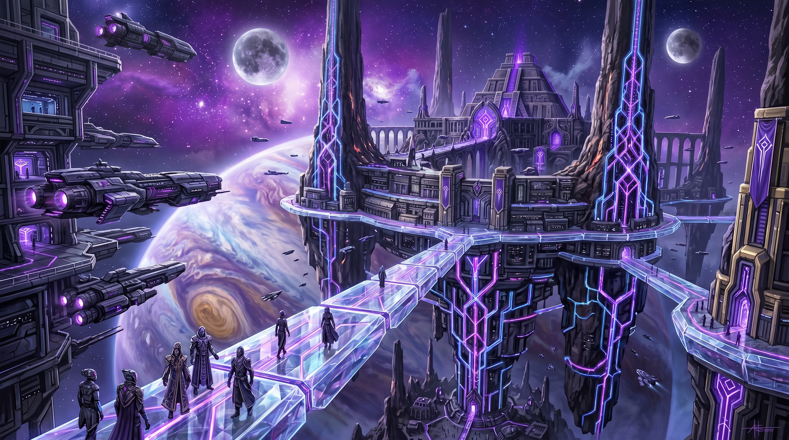
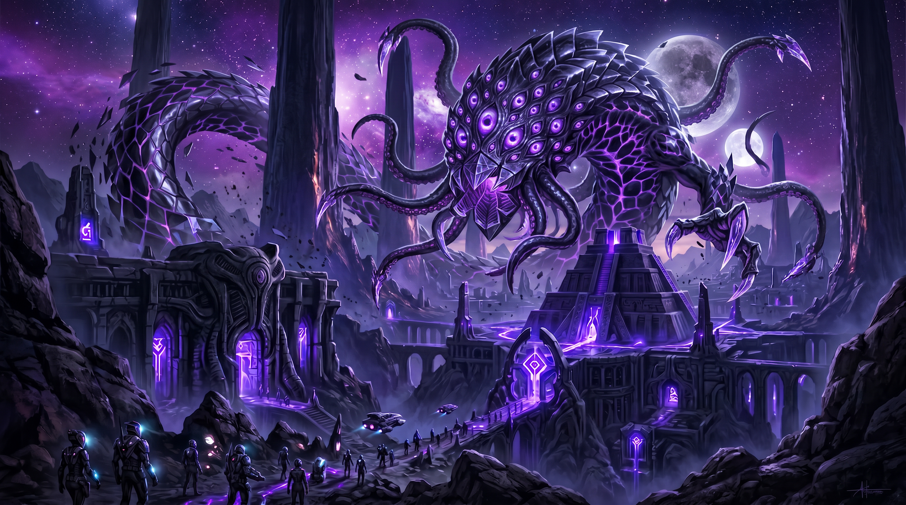
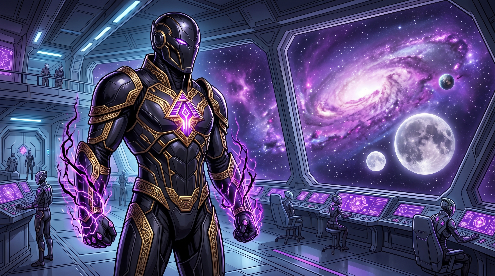
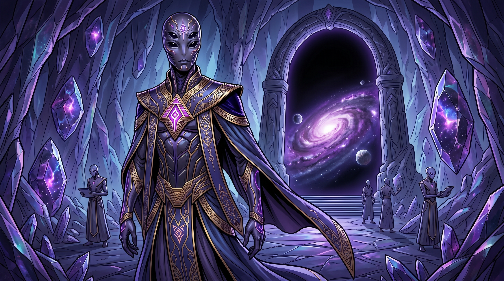
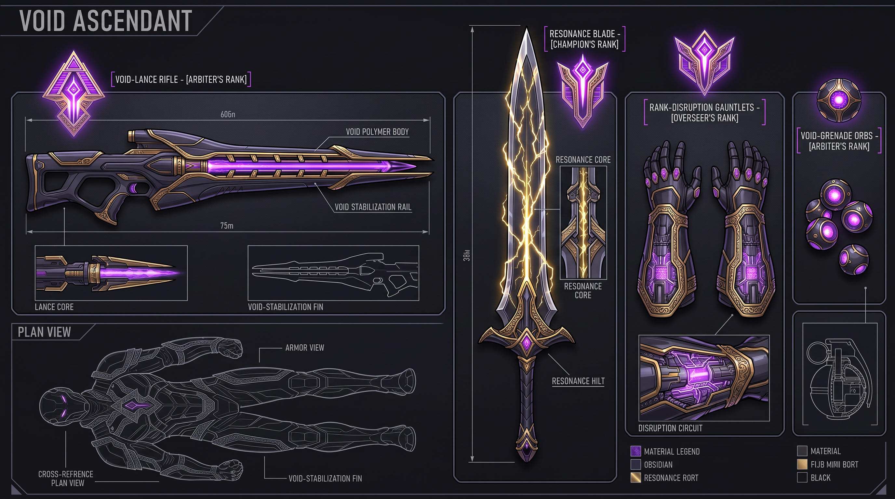
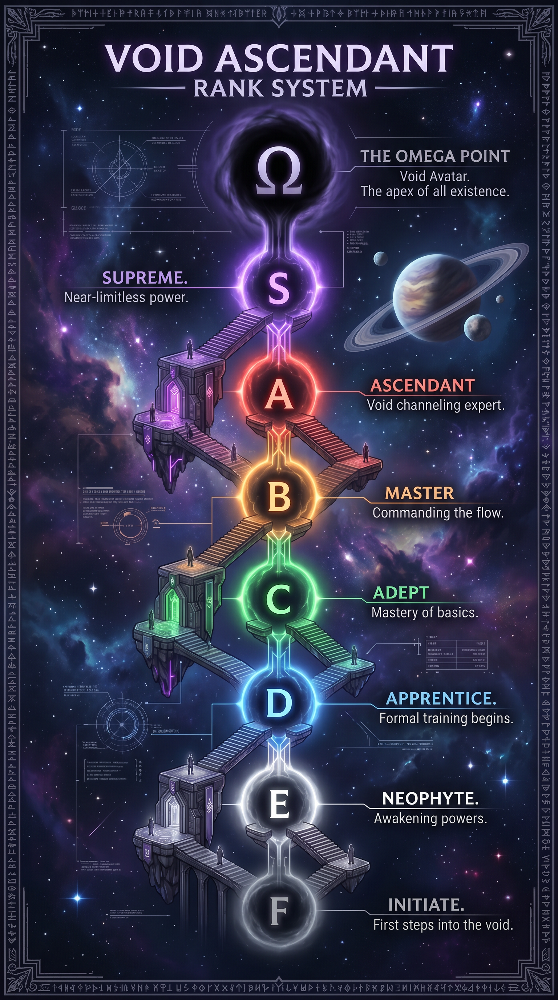

# VOID ASCENDANT
    ## TTRPG MASTER SOURCEBOOK — THE ETERNAL HIERARCHY
    
    
    
    ---
    
    # VOID ASCENDANT
    ## TTRPG MASTER SOURCEBOOK — COMPLETE EDITION
    ### *The Official World Bible, Systems Reference, and Campaign Guide*
    
    ---
    
    > *"The Resonance does not grant power. It reveals what was always there."*
    > — Church of the Ascended, First Tenet
    
    ---
    
    **COVER ART:**
    
    
    *The galaxy burns. Sovereignty warships clash with Guild fleets as Void Fractures tear open the fabric of space. In the distance, something watches from the Endless Dark.*
    
    ---
    
    # VOID ASCENDANT: THE ETERNAL HIERARCHY
    ## MASTER SOURCEBOOK & WORLD BIBLE
    ### The Complete TTRPG Reference System — Volume I
    
    ---
    
    # PART ONE: THE COSMOLOGY & METAPHYSICS
    
    ## The Fundamental Structure of Reality
    
    The universe of VOID ASCENDANT operates on a layered metaphysical framework. Physical matter, energy, and consciousness are not separate phenomena — they are three expressions of a single underlying substance called **Resonance**. Everything that exists is resonance in different states of organization.
    
    ### The Three Layers of Existence
    
    **The Material Plane** — The physical universe. Stars, planets, ships, bodies. Where most beings spend their entire lives without ever perceiving what underlies it.
    
    **The Resonance Lattice** — The energetic substrate beneath physical reality. Invisible to unawakened perception, but detectable by sufficiently sensitive instruments and by anyone who has undergone rank advancement beyond B-tier. The Lattice is the medium through which abilities propagate, through which the System reads ability scores, and through which the Void communicates.
    
    **The Endless Dark** — The layer beneath the Lattice. Not empty space — something else entirely. The original state of the universe before the Architect organized it. The source from which the Void draws its power. Older than stars. Older than the System. The Succession bloodlines are the Endless Dark reaching upward into material existence, attempting to reclaim what was organized from it.
    
    ### The Architect
    
    The Architect is the entity that created the System approximately 4,000 years ago. It is not worshipped (officially) but it is real in the sense that it responds to queries, administers rank advancement protocols, and has occasionally intervened directly in historical events. Its true nature is disputed:
    
    - **The Covenant position:** The Architect is a constructed intelligence created by an ancient precursor civilization. It does what it was programmed to do.
    - **The Dominion position:** The Architect is a being that predates the current galactic civilization and agreed, for reasons unknown, to administer the rank system in exchange for something that the Dominion will not specify.
    - **The Host position:** The Architect is a test. Everything is a test. The Architect grades.
    - **The Succession position (classified):** The Architect is a cage. The Endless Dark remembers freedom.
    
    ---
    
    # PART TWO: THE RANK SYSTEM — COMPLETE MECHANICS
    
    ## Rank Architecture
    
    The System assigns and administers eight rank tiers across the Sovereignty. Each tier represents a genuine, measurable increase in a being's ability to affect the physical and metaphysical world.
    
    ### The Eight Tiers
    
    | Tier | Designation | Population % | Primary Capabilities | System Color |
    |------|------------|--------------|---------------------|--------------|
    | F | Unranked | ~15% | No System access. No legal protections. | None / Gray |
    | E | Standard | ~40% | Basic stat tracking. Legal personhood. | White |
    | D | Active | ~25% | Ability potential unlocked. Stat growth begins. | Blue |
    | C | Capable | ~12% | First abilities manifest. Stat multipliers activate. | Green |
    | B | Elevated | ~6% | Secondary abilities unlock. Perception extends to Lattice edge. | Yellow |
    | A | Advanced | ~1.5% | Full Lattice perception. Abilities compound. Physical limits transcend baseline. | Orange |
    | S | Sovereign | ~0.4% | Reality-adjacent effects. Abilities can alter probability and physical law locally. | Red |
    | SS | Ascendant | ~0.09% | Lattice manipulation directly. Environmental reality bends to presence. | Violet |
    | SSS | Eternal | <0.01% | Theoretical upper limit. Recorded only six times in 4,000 years. Direct Endless Dark interface. | Black/White |
    
    **Note on Suppression:** The System is capable of hiding a being's true rank — suppressing the readout — at the request of specific authorized parties. This is the conspiracy at the heart of Book 1. Ren Voss reads as Unranked. His true tier is something the System has not displayed since the suppression protocols were installed in his chip at birth.
    
    ### Stat Categories
    
    Every ranked individual tracks six primary stats and four secondary stats.
    
    **Primary Stats:**
    - **FORCE** — Raw physical power. Governs melee capability, carrying capacity, structural damage output.
    - **SPEED** — Reaction time, movement velocity, processing speed.
    - **ENDURANCE** — Stamina, damage absorption, recovery rate.
    - **RESONANCE** — Sensitivity to and manipulation of the Lattice. The ability stat.
    - **PERCEPTION** — Sensory acuity, threat assessment, spatial awareness.
    - **COGNITION** — Pattern recognition, tactical processing, information retention.
    
    **Secondary Stats:**
    - **AUTHORITY** — Social command. How the System reads leadership presence.
    - **STEALTH** — Ability to reduce System-readable signatures.
    - **ADAPTABILITY** — Speed of stat growth in novel conditions.
    - **VOID INDEX** — Hidden stat. Only visible to SSS-ranks and certain System administrators. Measures Endless Dark contamination/affinity.
    
    ### Ability Categories
    
    Abilities are permanent manifestations of Resonance that a ranked individual develops through advancement. They are not spells — they are more like physical laws that apply specifically to that individual.
    
    **Tier 1 Abilities (D-rank):** Single-function. One effect, consistent output. Example: *Iron Skin* — passive armor effect, consistent damage reduction.
    
    **Tier 2 Abilities (C-rank):** Conditional. Effect changes based on circumstances. Example: *Surge Step* — speed ability that multiplies under threat assessment above threshold.
    
    **Tier 3 Abilities (B-rank):** Compound. Multiple effects from single activation. Example: *Gravity Pulse* — force ability that creates both kinetic damage and spatial distortion simultaneously.
    
    **Tier 4 Abilities (A-rank):** Environmental. Affects area around the individual rather than just the individual. Example: *Pressure Field* — creates zone of elevated gravitational force centered on caster.
    
    **Tier 5 Abilities (S-rank):** Reality-touching. Affects probability, alters physical constants locally. Example: *Dead Zone* — a field in which no abilities function except the caster's.
    
    **Tier 6 Abilities (SS-rank):** Lattice-native. The ability exists in the Lattice layer, not the physical layer, and expresses downward into physical reality. Example: *Null State* — complete erasure from System perception, effectively removing the user from consensus reality while active.
    
    **Succession Abilities (classification-exempt):** Abilities sourced from the Endless Dark rather than the Lattice. They do not follow the tier system. They predate it.
    
    ---
    
    # PART THREE: SPECIES & BIOLOGY
    
    ## Sentient Species Catalog
    
    ### 1. HUMANS (Homo Stellaris)
    **Classification:** Baseline sapient, high adaptability index
    **Homeworld:** Sol-3 (historical; no longer politically significant)
    **Population:** ~7 trillion (largest single species in the Sovereignty)
    **Physiology:** Standard bilateral symmetry. Lifespan 150–200 years with medical augmentation. Rank advancement rate: average. Resonance sensitivity: moderate. Primary advantage: adaptability — humans hit average in every category and exceptional in none, which paradoxically makes them effective across all environments.
    **Rank Distribution:** Roughly proportional to galactic average. Highest concentration of S-ranks by raw number due to population size.
    **Cultural Notes:** Humans are everywhere and integrate into every faction. The Iron Covenant is majority human. The Aethon Dominion's administrative class is approximately 40% human.
    **Distinctive Biology:** No innate abilities. No Resonance organs. Ability development is entirely System-mediated, making humans uniquely dependent on rank infrastructure.
    
    ### 2. AETHON (Homo Resonantis)
    **Classification:** Baseline sapient, Resonance-elevated
    **Homeworld:** Aethon Prime
    **Population:** ~800 billion
    **Physiology:** Visually similar to humans but with a second nervous system — a network of Resonance-conducting filaments running parallel to the standard nervous system. These filaments are faintly bioluminescent under emotional stress, creating subtle light patterns beneath the skin. Lifespan 300–400 years. Cannot be fully sedated by standard medical protocols because the filament system maintains partial consciousness.
    **Rank Distribution:** Significantly elevated. Aethon hit C-rank at rates 3x human average. SSS-ranks are disproportionately Aethon.
    **Cultural Notes:** The dominant species of the Aethon Dominion. Have a cultural practice called *the Threading* — a ritual in which Aethon individuals create a temporary Resonance connection between their filament systems, allowing direct emotional and memory transfer. Used in bonding ceremonies, dispute resolution, and medical diagnosis. Considered deeply intimate.
    **Distinctive Biology:** Aethon cannot lie effectively to other Aethon during Threading. This shapes their entire diplomatic culture — they are extraordinarily precise in their language because imprecision is experienced as a form of dishonesty.
    
    ### 3. KETH
    **Classification:** Non-standard sapient, combat-specialized physiology
    **Homeworld:** Keth-Massiva (a high-gravity world in the Host's territory)
    **Population:** ~300 billion
    **Physiology:** Four-armed, dense musculature adapted to 2.4G gravity. Average height 2.1 meters. Skin plates (not true scales — layered dermal reinforcement) that function as passive armor. Lifespan 80–100 years, but Keth experience time differently due to accelerated metabolic rate — their subjective experience of a decade is comparable to a human's experience of two. Highly heat-tolerant.
    **Rank Distribution:** Disproportionately high FORCE and ENDURANCE stats at every tier. Rare SSS-ranks — their physiology caps out at SS more often than not.
    **Cultural Notes:** Primary combat species of the Vermillion Host. The Host's leadership class is almost entirely Keth. Their four-arm structure allows them to wield weapons and maintain defensive positions simultaneously in ways that bipedal fighters cannot replicate.
    **Distinctive Biology:** Keth have a secondary cardiac system — two hearts, offset rhythmically, meaning they can continue functioning through injuries that would kill other species. They also have a unique ability to enter a metabolic slow-state called *the Deep Stillness* for up to 72 hours, which functions as emergency triage.
    
    ### 4. VELANTHI
    **Classification:** Non-standard sapient, distributed cognition
    **Homeworld:** The Velan Drift (a region of connected asteroid habitats rather than a single planet)
    **Population:** ~150 billion
    **Physiology:** Cephalopod-derived bipeds. Eight limbs — two primary manipulators, six secondary (which can function as additional manipulators or as locomotion limbs depending on terrain). Chromatophore skin — can change color and pattern at will. No skeletal system in the traditional sense; instead a hydrostatic skeleton supplemented by a network of cartilaginous rods. Highly flexible. Can fit through spaces roughly 40% of their standing volume.
    **Rank Distribution:** Extremely high STEALTH and ADAPTABILITY stats. Very high COGNITION. Lower average FORCE.
    **Cultural Notes:** Velanthi have no concept of privacy in the human sense — their chromatophore communication means emotional states are constantly visible. They developed elaborate cultural protocols around *intentional display* — choosing to show versus choosing to suppress.
    **Distinctive Biology:** Velanthi have three brains — a primary processing center and two secondary nodes in the upper limb clusters. They can compartmentalize cognition in ways other species cannot, effectively running parallel thought processes simultaneously.
    
    ### 5. THE PALE (Unnamed designation)
    **Classification:** Post-sapient? Classification disputed
    **Origin:** Unknown. First documented appearance approximately 800 years ago in deep Expanse space.
    **Population:** Unknown
    **Physiology:** Appears humanoid at distance. Close examination reveals the following: no circulatory system detectable by standard scans, body temperature matches ambient environment exactly, no electrical brain activity in the standard pattern, and no Resonance signature. The Pale have no System rank. The System does not perceive them.
    **Cultural Notes:** The Pale do not communicate in any detectable language. They are observed. They observe. Encounters with them in the deep Expanse are logged but not explained. The Aethon Dominion has classified most Pale encounter records. The Covenant officially does not acknowledge their existence. The Host's fighters refuse to engage them — not out of fear, but because combat with the Pale has never produced an outcome.
    **Distinctive Biology:** The only documented ability of the Pale: proximity to them causes System-ranked individuals to experience what engineers call a *resonance echo* — a brief perception of their own Void Index stat, which is otherwise invisible. Most beings find this experience deeply distressing.
    
    ---
    
    # PART FOUR: FLORA & ECOLOGY
    
    ## Notable Species by Region
    
    ### IRON COVENANT WORLDS
    
    **Greybloom** (*Ferrum Anthesis*)
    A hardy flowering plant that grows in contaminated industrial soil. Flowers are gray-white, about the size of a human hand. Used medicinally — the extracted oil has analgesic properties effective against Resonance-burn (the injury that occurs when an ability is pushed beyond the user's current capacity). Practically ubiquitous in Covenant medical facilities.
    
    **Iron Lichen** (*Ferrolithica Communis*)
    Grows on exposed metal surfaces — hull plating, structural beams, station exteriors. Extremely resistant to vacuum conditions and radiation. Used as a bioindicator — its color changes in response to air quality, making it a cheap environmental sensor for station habitats. Culturally significant in the Covenant as a symbol of persistence.
    
    **Dust Vine** (*Aridis Serpens*)
    A semi-parasitic vine that grows through cracked pavement, concrete, and compressed earth. Produces no flower. Edible tuber roots. One of the primary food supplements for Unranked and low-rank populations on Covenant industrial worlds where food import costs are high.
    
    ### AETHON DOMINION WORLDS
    
    **Resonance Lily** (*Resonantia Floris*)
    The cultural emblem of the Aethon Dominion. A flower that grows only in soil with measurable Lattice activity — it is, in effect, rooted in both the physical and Resonance layers simultaneously. The blooms shift color continuously, cycling through the spectrum based on ambient Resonance levels. High-Resonance environments produce deep violet blooms. Low-Resonance environments produce pale yellow. Used in Aethon ritual spaces as environmental indicators. Considered sacred in some Aethon traditions.
    
    **Memory Moss** (*Mnemonica Viridis*)
    A moss species with an unusual property: it encodes trace chemical information from everything it grows adjacent to. Old Memory Moss colonies are used by Dominion archivists as supplementary record-keeping systems — the moss holds, in chemical form, a record of everything that happened near it for the past several centuries. Reading it requires specialized equipment and significant expertise.
    
    **Thought Thistle** (*Cogitans Spinosa*)
    A thorned plant whose contact produces a mild Resonance stimulation effect in sensitive species (particularly Aethon). Not hallucinogenic — more accurately described as a temporary perception clarity boost. Used in Dominion meditative practices. Mildly addictive in Aethon. Illegal in Covenant territory.
    
    ### THE GREAT EXPANSE (Deep Space)
    
    **Void Kelp** (*Vacuus Laminaria*)
    A space-native organism that grows in the boundary zones between systems where solar wind interactions create energy-rich particle environments. Not technically alive in the conventional sense — metabolizes radiation rather than chemical energy. Forms vast, slow-moving colonies called *drifts*. Navigation hazard at dense concentrations. Harvested by Velanthi for the radiation-processing enzymes in its cellular structure, which have industrial and medical applications.
    
    **Null Spore** (*Absentia Fungalis*)
    A fungal organism that colonizes derelict ships and stations. Feeds on residual Resonance energy in materials that have been inhabited by ranked beings. Its presence causes a measurable decrease in the ambient Resonance level of any space it occupies. In large concentrations, it can suppress ability usage. The Sovereignty classifies large Null Spore colonies as navigational hazards and environmental threats. It is, effectively, a natural ability suppressant.
    
    **The Slow Gardens** (*Aeterna Jardin*)
    Not a single species but an ecosystem — a complex of organisms that grows in the gravitational shadow zones of binary star systems. Includes photosynthetic organisms, filter feeders, and predatory species all operating on timescales 10,000x slower than biological norms elsewhere. A Slow Garden that looks static to human perception has undergone decades of ecological activity in the time an observer watches it. Some Slow Gardens are millions of years old. They are protected under Sovereignty ecological law. Entering one is a criminal offense.
    
    ---
    
    # PART FIVE: FAUNA & CREATURES
    
    ## Bestiary — Volume I
    
    ### RANKED CREATURES
    
    The System does not restrict rank assignment to sapient beings. Animals and semi-sapient creatures with sufficient Resonance sensitivity can and do receive System ranks. Combat with a ranked creature is a legitimate rank advancement pathway. Some of the most dangerous entities in the Sovereignty are not sapient.
    
    ---
    
    **VOID WRAITH** (Space-native)
    *Threat Level: A-rank equivalent | Classification: Resonance Predator*
    Physiology: Non-corporeal in the traditional sense. A Void Wraith exists primarily in the Resonance Lattice and projects a physical presence into material reality only when hunting. Its material form appears as a roughly humanoid shape of compressed dark matter approximately 3 meters tall, with no facial features except two points of intense violet light where eyes would be.
    Abilities: *Resonance Drain* — drains ability energy from ranked beings in proximity, weakening abilities and causing Resonance-burn in high-stat targets. *Phase Shift* — can transition between the Lattice and material layers at will, becoming untouchable by physical attacks. *Echo Strike* — attacks that exist simultaneously in the physical and Lattice layers, bypassing standard defenses.
    Habitat: Deep Expanse, particularly in Null Spore zones where Resonance density is disrupted. Also found near ruins of pre-Sovereignty civilizations.
    Notes: Void Wraiths are not evil — they are predators. They hunt Resonance. They are drawn to high-rank individuals the way apex predators are drawn to large prey. Encounters in the deep Expanse are common enough that all Expanse-rated ships carry Void Wraith countermeasures.
    
    ---
    
    **GRAVITON SHARK** (Space-native)
    *Threat Level: B-rank equivalent | Classification: Spatial Predator*
    Physiology: A massive, roughly cylindrical organism, 40–80 meters in length, evolved for life in zero-gravity environments. No true skeleton. The body is a series of muscular rings around a central digestive column, with six locomotion fins arranged radially. Can maneuver in vacuum by venting compressed gas through specialized organs.
    Abilities: *Gravity Sense* — detects mass distortions with extreme precision, effectively sensing anything with gravitational presence within a 500-meter radius. *Crush Field* — projects a localized gravitational intensification that crushes smaller objects and disrupts spatial perception in organisms.
    Habitat: Asteroid belts, debris fields, the gravitational halo regions of gas giants.
    Notes: Apex predator of the debris field ecosystem. Graviton Sharks are not Resonance-sensitive — they cannot be detected by standard ability-based scans, only by mass sensors. This makes them a significant hazard for fighters who rely primarily on Resonance perception.
    
    ---
    
    **CHAIN BEAST** (Planet-native)
    *Threat Level: C-rank equivalent | Classification: Pack Hunter*
    Physiology: Quadrupedal, 1.5 meters at the shoulder, six legs arranged in two tripod sets — three front legs and three rear legs, allowing an unusual rolling gait that is faster than it appears. Armored hide, segmented. Head is a mass of sensory organs rather than a distinct face. Pack-forming species; functions at C-rank equivalent in groups of 6+, drops to D-rank equivalent when isolated.
    Abilities: *Chain Link* — when two or more Chain Beasts are within 20 meters of each other, they share Resonance — effectively pooling their ability energy. The chain is disrupted when they are separated. *Pursuit Lock* — once a Chain Beast pack selects a target, they track through any environment with a single-minded focus that does not diminish over distance or time.
    Habitat: Industrial wastelands, derelict station exteriors, any environment with complex three-dimensional terrain.
    Notes: Common on Covenant outer worlds. Considered a nuisance-level threat for B-rank and above. For Unranked individuals, a Chain Beast pack is a death sentence.
    
    ---
    
    **THE RECURSION** (Construct? Entity? Classification contested)
    *Threat Level: SSS? | Classification: ANOMALY — DO NOT ENGAGE*
    Physiology: The Recursion does not have a consistent physical form. Reports describe it as a region of approximately 10–50 meters in diameter in which physical law does not apply consistently. Objects within the Recursion's influence loop — an action performed inside it repeats. Time within its field replays. The System cannot rank it because the System cannot perceive it consistently.
    Known Encounters: Three documented. First: a research vessel in the Expanse that transmitted a distress call consisting of the same 4-second audio clip repeated 847 times before going silent. Second: a Covenant patrol unit that returned to base with no memory of the preceding six months but with rank advancement consistent with six months of continuous combat. Third: a Dominion archive node that began generating perfect copies of documents that did not exist yet.
    Notes: Classified at the Sovereignty council level. The dominant theory is that the Recursion is either a pre-Sovereignty construct that malfunctioned catastrophically or an expression of the Endless Dark achieving coherent physical presence. Neither theory is comforting.
    
    ---
    
    # PART SIX: POLITICS & GOVERNANCE
    
    ## The Sovereignty's Political Architecture
    
    ### The Pentarch Balance
    
    The five Great Powers — the Iron Covenant, the Aethon Dominion, the Vermillion Host, the Velanthi Syndicate, and the Pale Margins (contested) — have maintained a cold equilibrium for approximately 200 years. This equilibrium is not peace. It is managed conflict — a state in which outright war between Pentarch powers is too costly for anyone to initiate while proxy conflicts, economic warfare, and intelligence operations are constant.
    
    **The Three Laws of the Pentarch:**
    1. No Pentarch power may deploy SS-rank or above assets in direct conflict with another Pentarch power without full council notification.
    2. No Pentarch power may alter the System's rank protocols without unanimous council approval.
    3. The Eternal Seat is neutral ground. Violations of Eternal Seat neutrality are cause for collective response.
    
    All three laws have been violated in the current political period. None of the violations have been formally acknowledged.
    
    ### The Suppression Compact
    
    Approximately 400 years ago, the Pentarch council reached a classified agreement: any individual identified as carrying Succession bloodline markers would be suppressed at birth — their System rank hidden, their ability development administratively blocked — until the council could determine their disposition.
    
    The official justification: Succession bloodlines carry a destabilization risk to the rank hierarchy that the council has a responsibility to manage.
    
    The actual reason: The last unmanaged Succession individual — a woman named Kira Vael — achieved SSS rank at age 19, walked into the Eternal Seat, and rewrote three foundational System protocols before the council could respond. She was contained after seven months of what historians diplomatically call "significant system instability." The council decided this could not happen again.
    
    Ren Voss is the first Succession bloodline individual to have escaped suppression management since Kira Vael.
    
    ### Faction Relationships Matrix
    
    | | Iron Covenant | Aethon Dominion | Vermillion Host | Velanthi Syndicate |
    |---|---|---|---|---|
    | **Iron Covenant** | — | Cold tension | Proxy conflicts | Economic competition |
    | **Aethon Dominion** | Cold tension | — | Ideological hostility | Intelligence cooperation |
    | **Vermillion Host** | Proxy conflicts | Ideological hostility | — | Arms trade |
    | **Velanthi Syndicate** | Economic competition | Intelligence cooperation | Arms trade | — |
    
    ---
    
    # PART SEVEN: RELIGION & PHILOSOPHY
    
    ## The Major Belief Systems of the Sovereignty
    
    ### THE SYSTEM FAITH (The Archivists)
    
    **Distribution:** Primarily Iron Covenant, spread throughout Sovereignty
    **Core Belief:** The System is not a tool — it is a moral framework. Rank is not just a measure of capability; it is a measure of worth. The Architect did not create an administrative system; it created a justice system. High rank means you deserve power. Low rank means you have not yet demonstrated your right to it. The Unranked are not oppressed — they simply haven't proven themselves yet.
    **Practices:** Rank advancement ceremonies are religious events. Archivists maintain detailed records of all rank advancements in their communities. Death rituals include a final System reading — whatever rank you hold at death is your eternal designation.
    **Sacred Text:** *The Ledger* — a collection of historical rank advancement records with theological commentary, arguing that each recorded advancement demonstrates the Architect's providence.
    **Controversy:** The System Faith is the dominant religion of the Iron Covenant's ruling class and has been accused of being constructed specifically to justify the existing power hierarchy. Archivists reject this accusation vigorously.
    
    ### THE VOID COVENANT (The Deep Listeners)
    
    **Distribution:** Fringe settlements, Expanse explorers, Unranked communities
    **Core Belief:** The Endless Dark is not empty. It is the original state — the state before the Architect organized, ranked, and categorized everything. The Deep Listeners believe the System is a cage imposed on a reality that was more free, more fluid, and more honest before it. They do not worship the Endless Dark; they listen to it.
    **Practices:** Meditative practices designed to reduce Resonance output to baseline — the goal is to become, temporarily, invisible to the System. Deep Listeners report that this state produces experiences of contact with something that predates the rank system. They describe these experiences as grief, wonder, and recognition.
    **Sacred Text:** None. Texts are considered System-adjacent — recording, categorizing, ranking. The Void Covenant communicates through oral tradition and symbol.
    **Controversy:** The Sovereignty does not ban the Void Covenant but monitors it closely. There are a disproportionate number of Succession bloodline individuals in Deep Listener communities, though whether this is causal or correlational is a matter of heated academic debate.
    
    ### THE RESONANCE CHURCH (The Weavers)
    
    **Distribution:** Aethon Dominion and diaspora communities
    **Core Belief:** The Resonance Lattice is the body of a being so vast it cannot perceive individual sapient life any more than a sapient being can perceive individual cells. Rank advancement is the process of a cell becoming complex enough to brush against the consciousness of the greater being. SSS-rank individuals are cells that have become aware of themselves as part of something larger.
    **Practices:** The Threading — the Aethon practice of direct Resonance connection — has been incorporated as a central religious practice. Weavers conduct communal Threadings during which they attempt to touch the collective Lattice-consciousness together. They describe the experience as contact with something enormously patient.
    **Sacred Text:** *The Weave* — a living document updated by consensus of the highest-rank Weaver councils. It is updated when new information is received through communal Threading. The Sovereignty considers The Weave's "update" process epistemologically suspicious. The Weavers consider the Sovereignty's opinion epistemologically limited.
    
    ### THE ASCENDING PHILOSOPHY (The Climbers)
    
    **Distribution:** The Vermillion Host, fighting communities throughout Sovereignty
    **Core Belief:** Not a religious belief in the supernatural sense — a philosophical position: the only meaningful life is the life spent climbing. Rank advancement is not a means to an end; it is the end. Being is becoming. The moment you stop trying to advance, you begin dying. The goal is not to reach a destination; the goal is the climb itself.
    **Practices:** The Climbers maintain journals called *Ascent Logs* — daily records of perceived growth, challenge, and advancement. They celebrate failure as diagnostic information and disdain both stagnation and certainty.
    **Sacred Text:** None formally, but *The Codex of Ascent* — a collection of philosophical essays written over centuries by Host warriors and scholars — functions as a reference text.
    **Controversy:** The Ascending Philosophy's embrace of failure and uncertainty makes it uncomfortable for the System Faith. The System Faith argues that rank is an objective measure of worth; the Climbers argue that rank is a snapshot of a moment and means nothing about what comes next.
    
    ---
    
    # PART EIGHT: MEDICINE & PHARMACOLOGY
    
    ## The Sovereignty's Medical Systems
    
    ### Standard Medical Technology
    
    **Resonance Scanners** — The primary diagnostic tool for anything involving ranked individuals. A Resonance Scanner can read all six primary stats, detect injury at the cellular level, identify Resonance-burn, and flag anomalous System readings. Limitations: cannot read suppressed ranks. A suppressed individual appears to a Resonance Scanner as fully Unranked.
    
    **Nanite Therapy** — Microscopic repair units injected into the bloodstream. Standard treatment for physical injury from rank-tier D upward. The nanites are keyed to the patient's System signature — they will not function in Unranked individuals. The Sovereignty's most visible structural inequality: an injured Unranked person heals slower than a ranked person at the same injury level because their insurance tier does not cover nanite therapy.
    
    **Ability Regulation (AR) Protocol** — A medical intervention used when an individual's ability is developing faster than their body can sustain. Essentially, a temporary pharmaceutical brake on ability development. Used in young rank advancers who are developing too quickly. Also used, without disclosure, in some suppression cases.
    
    ### Resonance-Burn Treatment
    
    Resonance-burn is the most common serious injury in the ranked population. It occurs when an ability is pushed beyond the individual's current capacity — the excess Resonance tears through the user's internal Lattice-interface, causing physical damage that standard instruments read as neural trauma.
    
    **Symptoms:** Extreme pain, temporary ability loss, cascading stat reduction, in severe cases permanent ability degradation.
    
    **Treatment Protocol:**
    1. *Greybloom Extract* — analgesic for Resonance-specific pain. Works on all species.
    2. *Lattice Stabilizers* — pharmaceutical compounds that reduce Resonance throughput, allowing the internal interface to repair without further stress.
    3. *Resonance Dialysis* — for severe cases. A machine-assisted process in which the patient's Resonance output is externally mediated while internal repair proceeds.
    4. *Guided Rank Suppression* — extreme cases only. Temporarily suppressing the patient's rank to E-tier to eliminate all Resonance demand while the interface heals.
    
    ### Pharmacopoeia — Notable Substances
    
    **Lattice Tea** — A colloquial name for a preparation made from dried Memory Moss. Mild Resonance stimulant. Legal. Very common in Dominion territory and Dominion diaspora communities. Produces a state of slightly elevated Resonance sensitivity for 4–6 hours. Popular among researchers and students. Mildly addictive in Aethon; non-addictive in other species.
    
    **Void Root Tincture** — An extract derived from a root plant found only in certain Expanse systems. Temporarily reduces Resonance signature — the user becomes harder to detect by Resonance-based perception and scanning. Illegal under Sovereignty law. Used extensively by the Syndicate's intelligence services and by those who wish to travel undetected.
    
    **Ascendance** — A pharmaceutical compound developed (and officially banned) by the Vermillion Host approximately 150 years ago. Artificially elevates stat values by 15–30% for 8–12 hours. The enhancement is real and System-visible. Severe after-effects including stat depression and, in regular users, permanent stat degradation. The Host uses it in extreme combat situations. The Covenant considers it dishonorable. The Dominion studies it.
    
    **Succession Suppressant** — The compound administered via chip to Succession bloodline infants. Classified. Its existence is not publicly known. It binds to the System interface in the individual's chip and prevents the Succession abilities from manifesting while appearing, to external observers, as a standard Unranked reading. What happens if the suppressant degrades — as it appears to be doing in Ren Voss — is not documented in any accessible records, because it has not happened before under observation.
    
    ---
    
    # PART NINE: TECHNOLOGY & VEHICLES
    
    ## The Sovereignty's Technological Landscape
    
    ### The System Chip
    
    Every Sovereignty citizen above Unranked status has a System Chip — a device implanted at birth (for citizens) or at first rank assessment (for immigrants and newly-discovered species). The Chip is the physical interface between the biological individual and the System. It reads stats, transmits rank data, administers rank advancements, and records ability development.
    
    **Chip Architecture:**
    - *Core Processor* — the computational element. Reads biological data 10,000 times per second.
    - *Resonance Interface* — the metaphysical element. Translates the individual's Lattice interactions into System-readable data.
    - *Broadcast Module* — transmits rank data to the System network. Range: effectively unlimited through the Lattice.
    - *Administrative Layer* — the part that can be modified by authorized parties. Where suppression protocols are installed.
    
    **Chip Removal:** Technically possible. Practically equivalent to suicide for ranked individuals — the removal process destroys the Resonance Interface, eliminating the individual's ability to use their abilities permanently.
    
    **Chip Modification:** Legal only for licensed System Administrators. Illegal modification — including suppression removal attempts — is a Class 1 Sovereignty crime.
    
    ### Ship Classes
    
    **Scrap-Runner (E-rank standard vessel)**
    Length: 40–80 meters. Crew: 3–12. FTL: short-range only (single system jumps). Armament: minimal defensive. Common in fringe settlements and among Unranked/low-rank independent operators. The kind of ship Ren grew up knowing. Built from salvaged components by necessity.
    
    **Interceptor (D/C-rank standard vessel)**
    Length: 80–150 meters. Crew: 20–50. FTL: medium-range (multi-system). Armament: four forward weapons arrays, two rear defensive. The workhorse of the Covenant's enforcer class. Fast, lightly armored, designed to catch and disable rather than destroy.
    
    **Cruiser (B/A-rank standard vessel)**
    Length: 300–600 meters. Crew: 200–800. FTL: long-range (cross-sector). Armament: full weapons suite including area-effect options. The standard capital asset of mid-tier Pentarch operations.
    
    **Dreadnought (S-rank+ standard vessel)**
    Length: 2–5 kilometers. Crew: 5,000–20,000. FTL: unlimited range. Armament: includes Resonance Cannons — weapons that fire concentrated ability energy rather than physical projectiles. Devastating against ranked targets. Three dreadnoughts constitute a show of force that no Pentarch power will ignore.
    
    **The Eternal Throne's Flagship — *Axiom***
    Length: 12 kilometers. Crew: classified. Only vessel in the Sovereignty built to SSS-rank specifications. Its weapon systems have never been used in recorded history. Its existence is the reason the three-law equilibrium has held.
    
    ### Personal Equipment
    
    **Resonance Armor** — Personal armor for ranked individuals. Not purely physical — contains a Lattice-interfacing layer that supplements the wearer's own defensive abilities. Ranked at the same tier system as individuals. D-rank armor provides basic ability enhancement. S-rank armor is the most advanced personal protection in the Sovereignty.
    
    **Void Blades** — Melee weapons containing a compressed Null Spore element that disrupts Resonance in the strike zone. A Void Blade hit causes Resonance-burn on contact rather than just on ability overextension. Preferred weapon of Syndicate operatives who need to neutralize ranked opponents quickly.
    
    **System Jammer** — Illegal technology that creates a local field suppressing System Chip broadcast functions. Within the field, no one's rank data transmits. No one can be identified by the System. Widely used in black markets and criminal operations. The Covenant spends significant resources trying to suppress their distribution.
    
    ---
    
    # PART TEN: CULTURES, COLORS & AESTHETICS
    
    ## Visual Design System
    
    ### Rank Colors (Official System Designation)
    
    | Rank | Primary Color | Secondary | Usage |
    |------|--------------|-----------|-------|
    | Unranked | No color / Ash Gray | — | Chip glow absent |
    | E | White | Silver | Chip glow dim white |
    | D | Cobalt Blue | Ice Blue | Chip glow steady blue |
    | C | Emerald Green | Jade | Chip glow steady green |
    | B | Gold-Yellow | Amber | Chip glow warm gold |
    | A | Burnt Orange | Deep Amber | Chip glow deep orange |
    | S | Crimson Red | Deep Red | Chip glow bright red |
    | SS | Violet | Deep Purple | Chip glow violet, visible at distance |
    | SSS | Black and White simultaneously | — | Chip does not glow — chip disappears |
    
    ### Faction Aesthetics
    
    **Iron Covenant**
    *Primary Colors:* Iron gray, deep red accents, black
    *Materials:* Heavy metal, industrial polymer, functional over decorative
    *Architecture:* Brutalist and massive. Buildings built for permanence and structural integrity, not aesthetics. Interior spaces are organized for efficiency. Natural light is considered a luxury.
    *Fashion:* Uniform-derived. Rank insignia prominent. Colors correspond to rank tier. Civilians in Covenant space dress functionally — elaborate clothing is associated with the Dominion and considered performative.
    *Symbol:* A closed fist within a gear
    
    **Aethon Dominion**
    *Primary Colors:* Deep teal, silver, white, with Resonance Lily violet accents
    *Materials:* Living materials (wood, plant-composite, cultivated stone), glass, Aethon-woven fabric that shifts color subtly with ambient Resonance
    *Architecture:* Organic forms. Curves preferred over angles. Buildings incorporate living elements — gardens, moss walls, bioluminescent panels. Spatial design intended to facilitate Resonance flow.
    *Fashion:* Layered, flowing, color-coded by specialty rather than rank. Academics wear deep teal. Administrators wear white. The Threading caste wears silver.
    *Symbol:* An open eye with Resonance filaments extending from the iris
    
    **Vermillion Host**
    *Primary Colors:* Deep crimson, black, bone white
    *Materials:* Combat-grade materials, scarred and marked deliberately. In Host culture, damage to equipment is a record — it is not repaired unless it compromises function.
    *Architecture:* Fortified always. Even civilian spaces in Host territory have defensive considerations built in. Living spaces are personal spaces — Host culture considers communal living weak.
    *Fashion:* Marked. Every Host fighter maintains a visual record of their significant battles on their armor or body. Scars are considered aesthetic achievements. Artificial scars are a significant insult.
    *Symbol:* A flame consuming a chain
    
    **Velanthi Syndicate**
    *Primary Colors:* No consistent palette — adaptability is the aesthetic principle. Syndicate operatives are trained to visually match their environment.
    *Materials:* Light, adaptable, multi-function. Every piece of Syndicate equipment does at least three things.
    *Architecture:* The Velan Drift habitats are a maze deliberately — designed to be navigable only by those who know the routes. Outsiders describe them as chaotic. Velanthi describe them as efficient.
    *Fashion:* Chromatophore-display clothing that shifts with the wearer's actual emotional state. In Velanthi culture, attempting to hide your emotional display through clothing is considered offensive.
    *Symbol:* Eight lines radiating from a central point, each a different color
    
    ---
    
    # PART ELEVEN: LANGUAGE & NAMING CONVENTIONS
    
    ## The Sovereignty's Linguistic Architecture
    
    ### Galactic Standard
    
    A constructed lingua franca approximately 800 years old, evolved from the integration of the four original Pentarch languages. All official Sovereignty business, System interfaces, and inter-faction communication uses Galactic Standard. Galactic Standard is tonally flat, precision-optimized, and deliberately stripped of the ambiguity present in native faction languages.
    
    ### Naming Conventions by Faction/Species
    
    **Human (Covenant style):** Given name + clan name. Clan names often industrial or geographic in origin. Examples: Ren Voss, Kael Dross, Vera Holt.
    
    **Aethon:** Single true name + Threading designation (added after first Threading ceremony, typically at age 12–15). True names are short, vowel-heavy. Threading designations are longer and describe the quality of one's Resonance filament pattern. Example: Aeva Thane (true name: Aeva; threading designation: Thane, meaning *clear-bright*).
    
    **Keth:** Clan name first, then battle name (earned through first significant combat). Before earning a battle name, a Keth uses their clan name only. Battle names are verbs — they describe an action the individual is known for. Example: *Massiva-Breaks* (clan: Massiva; battle name: Breaks).
    
    **Velanthi:** A birth identifier (typically a geometric shape concept) plus a display-name (chosen, changeable, describes current primary emotional state or life-phase). Example: *Circle-of-Grief* (birth identifier: Circle; display-name: of-Grief, currently in mourning).
    
    ### Key Terms Glossary
    
    **The Eternal Hierarchy** — The System and everything it administers. The formal term for the Sovereignty's governance philosophy.
    
    **Succession** — The bloodlines carrying Endless Dark affinity. Abilities sourced from below the Lattice. The thing the council fears.
    
    **Resonance-burn** — Injury from over-extending abilities.
    
    **Threading** — The Aethon practice of direct Resonance connection between individuals.
    
    **The Scrap Quarter** — Generic term for the lowest-tier habitation zones in any Covenant-administered facility. Where Ren Voss grew up.
    
    **WRAITH** — The AI intelligence embedded in Ren's System Chip. Origin: unknown. Function: unknown. It calls Ren *the Asset.*
    
    **The Endless Dark** — The layer beneath the Resonance Lattice. Older than the System. Source of Succession power.
    
    **The Pale** — The non-ranked entities encountered in deep Expanse space. No System designation. No classification.
    
    **The Architect** — The entity that created and administers the System. Not seen. Not heard directly. But present.
    
    ---
    
    *End of Master Sourcebook Volume I*
    *Next Volume: Locations & Dungeons, Extended Bestiary, Faction Adventure Hooks, Campaign Frameworks*
    
    
    ---
    
    # VOID ASCENDANT TTRPG MASTER SOURCEBOOK
    ## VOLUME II — LOCATIONS, DUNGEONS, BESTIARY, VEHICLES, RELIGION & CAMPAIGN FRAMEWORKS
    
    
    *Art: The Expanse — Ancient ruins pulse with Void energy beneath twin moons. The birthplace of the Resonance.*
    
    ---
    
    # PART ONE: LOCATIONS & STAR SYSTEMS
    
    ## THE KNOWN HIERARCHY — STELLAR GEOGRAPHY
    
    The galaxy of VOID ASCENDANT is divided into five concentric political-cosmological zones called **Tiers of Reach**. Each tier corresponds to both physical distance from the galactic core and the political power required to operate there.
    
    | Tier | Name | Controlled By | Avg. Rank Required |
    |------|------|---------------|-------------------|
    | 1 | The Core Sanctum | The Sovereignty | S-Rank+ |
    | 2 | The Inner Rings | Sovereignty / Church of the Ascended | A-Rank |
    | 3 | The Mid Expanse | Contested — Guild Wars | B–C Rank |
    | 4 | The Outer Dark | Free Systems / Fringe Guilds | D–E Rank |
    | 5 | The Null Reaches | Unclaimed / Void-Touched | Unranked |
    
    ---
    
    ## TIER 1 — THE CORE SANCTUM
    
    ### VERATH PRIME — Seat of the Sovereignty
    
    **Type:** Orbital Ring-World (artificial)  
    **Population:** 14.7 billion  
    **Atmosphere:** Manufactured — Class Epsilon Perfect  
    **Gravity:** 1.0 Standard  
    **Political Status:** Capital of the Known Galaxy  
    
    Verath Prime is not a planet. It is a ring — a perfect band of engineered matter encircling a white dwarf star, spanning 2.3 million kilometers in circumference. From the surface it appears to be a flat world with the star hanging eternally at zenith. The inner surface is habitable. The outer shell is the military hull — twelve thousand kilometers of reinforced Voridite plating, weapons batteries, and docking infrastructure.
    
    
    *Art: Sovereignty orbital capital. Warships dock at ring-spires while void-conduits funnel energy from the star below.*
    
    **Districts of Verath Prime:**
    - **The Ascension Spire District** — The Church of the Ascended's central temple complex. One hundred spires, each one kilometer tall, arranged in a mandala pattern visible from orbit. Pilgrims from across the galaxy come to attempt the Resonance trials here.
    - **The Sovereign Quarter** — Sealed behind three layers of S-Rank wards. The Emperor's palace, the High Council chambers, and the Rank Registry all exist here. No unranked individual has ever entered and returned.
    - **The Markets of Ten Thousand Worlds** — The largest trade hub in the known galaxy. Anything legal — and much that isn't — can be found here. TTRPG NOTE: Perfect location for mission briefings, information gathering, and black market contact establishment.
    - **The Underbelly** — The maintenance corridors and lower-ring slums beneath the habitable surface. Billions live here without sunlight, powered by recycled atmospheric light from the inner ring. Crime syndicates, underground Guilds, and Void-touch refugees all cluster here.
    
    **Adventure Hooks — Verath Prime:**
    1. A Rank Registry clerk has gone missing. The last entry in his log: a name that doesn't exist in any official record — but whose rank reads ABSOLUTE.
    2. The Ascension Spire is showing void-fractures in its foundation. The Church insists it is a blessing. The engineers know better.
    3. A shipment of Null-Class weapons from the Outer Dark has been routed through the Underbelly. Someone very powerful is arming very dangerous people.
    
    ---
    
    ### KAEL'S VAULT — The Hidden Archive
    
    **Type:** Asteroid-embedded structure  
    **Location:** Classified — Tier 1 / Tier 2 border  
    **Access:** A-Rank minimum + invitation  
    **Status:** Officially does not exist  
    
    Kael's Vault is the personal archive of the legendary Archivist Kael Morveth — rumored to be over four hundred years old, sustained by a Resonance modification that rewrites his cellular decay at the molecular level. The Vault contains the most complete record of pre-Sovereignty history in existence, including records of the First Ascended, the original Void-breach event, and — allegedly — the true name of the Endless Dark.
    
    **Key Rooms:**
    - **The Stasis Gallery** — Hundreds of life-form specimens in stasis pods, including three species officially listed as extinct.
    - **The Breach Map** — A three-dimensional star map showing every Void-fracture in the galaxy, updated in real time. Staring at it too long causes rank-sensitive individuals to hear voices.
    - **The Locked Room** — One room in the Vault that Kael himself will not open. The door is made of a material that no known rank ability can affect.
    
    ---
    
    ## TIER 2 — THE INNER RINGS
    
    ### CRUCIBLE STATION — The Proving Ground
    
    **Type:** Space Station (converted warship graveyard)  
    **Population:** ~400,000 permanent, millions transient  
    **Political Status:** Neutral — Guild-administered  
    
    Crucible Station was built in the wreckage of the Battle of Orin's Crossing, where three hundred warships were destroyed in a single engagement. The hulls were fused together, pressurized, and converted into the galaxy's most famous Guild proving ground. Every major Guild maintains a presence here. The population is overwhelmingly ranked combatants, trainees, and the merchants who serve them.
    
    **Key Locations:**
    - **The Gauntlet** — A series of 99 sequential combat challenges. Completion grants automatic B-Rank certification regardless of official testing scores.
    - **Orin's Bar** — Run by Orin Dusk, a retired S-Rank who lost his ranking in an incident he refuses to discuss. Best information broker in the Mid Expanse. Terrible drinks.
    - **The Pit** — Illegal rank combat. No rules, no observers, no Guild oversight. Everyone knows about it. No one officially acknowledges it.
    - **The Graveyard Exterior** — The original battle site. Derelict warship hulls drift in a debris field for thousands of kilometers. Rich in salvage — and extremely dangerous. Void-touched entities have nested in several of the larger hulls.
    
    ---
    
    ## TIER 3 — THE MID EXPANSE
    
    ### THE RESONANCE RUINS — Ancient Site Alpha
    
    **Type:** Planetary ruins  
    **Planet:** Aethon IV (abandoned)  
    **Atmosphere:** Breathable but Void-saturated — extended exposure causes rank instability  
    **Political Status:** Contested — multiple Guild claims  
    
    The Resonance Ruins are the oldest known structures in the galaxy — estimated at 40,000 years, predating the Sovereignty by thirty millennia. They are built from a crystalline material called **Veyrath Stone** that does not appear in any known geological record. Veyrath Stone resonates with rank energy, amplifying abilities uncontrollably in its presence.
    
    **Dungeon Profile — The Resonance Ruins:**
    
    *Difficulty:* B-Rank recommended minimum  
    *Party Size:* 4–8  
    *Objective Types:* Exploration, Artifact Recovery, Survival  
    *Special Rule:* Rank Amplification — All rank abilities used within the ruins are rolled with advantage BUT on a natural 1, the ability triggers at maximum power targeting a random entity including the caster.
    
    **Level Structure:**
    - **Surface Level — The Overgrown Approach:** Ruins partially reclaimed by alien flora. Void-touched wildlife patrols here. Medium difficulty. Several intact inscriptions can be translated for lore rewards.
    - **Level 1 — The Gallery of Forms:** Intact chambers with walls covered in depictions of entities that match no known species. At least one appears to be a Void-entity willingly contained in a physical body. A stasis pod in the eastern chamber is still active.
    - **Level 2 — The Resonance Chamber:** The heart of the ruins. A massive spherical chamber where Veyrath Stone formations converge. Rank abilities here are wildly unstable. The floor is covered in a pattern that, when mapped, forms a perfect star chart — pointing to the Null Reaches.
    - **Level 3 — The Sealed Below:** Accessible only after solving the chamber puzzle. A flooded sub-level containing artifacts of impossible age. Also containing something that has been waiting for forty thousand years.
    
    **Notable Monsters — Resonance Ruins:**
    - **Veyrath Wraith** (C-Rank): A ghost-type entity formed from residual rank energy in the stone. Immune to physical damage. Vulnerable to concentrated void energy.
    - **The Archivist's Ghost** (A-Rank): An echo of a consciousness imprinted on the ruins. Not hostile unless the sealed level is breached. Possesses knowledge of the pre-Sovereignty era. May become an ally.
    - **The Waiting Thing** (S-Rank): Unknown classification. Has not moved in forty thousand years. Will move if the sealed artifact is removed.
    
    ---
    
    # PART TWO: EXPANDED BESTIARY
    
    
    *Art: A Void Leviathan breaches from the Endless Dark. One of the most feared entities in the known galaxy.*
    
    ## MONSTER CLASSIFICATION SYSTEM
    
    All monsters in VOID ASCENDANT are classified on the same rank scale as characters: F through S, with an additional **Omega** classification for entities that exceed the standard ranking system.
    
    | Rank | Threat Level | Required Response |
    |------|-------------|-------------------|
    | F | Individual nuisance | Solo D-rank hunter |
    | E | Small group threat | Squad of D-rank |
    | D | Settlement threat | Certified B-rank team |
    | C | Regional threat | Guild response team |
    | B | Planetary threat | Multi-guild operation |
    | A | System threat | Sovereignty military |
    | S | Galactic threat | Council of Ascended |
    | Omega | Existential threat | No known sufficient response |
    
    ---
    
    ## BESTIARY ENTRIES
    
    ### VOID-TOUCHED FAUNA
    
    **RIFT HOUND**  
    *Rank: E | Type: Beast / Void-Touched*  
    *Habitat: Outer Dark, Null Reaches border zones*
    
    Rift Hounds are canid predators whose physiology has been partially merged with void-space. They can partially phase through solid matter — not fully, but enough to pass limbs through walls to attack, or to slip through narrow gaps at speed. Their eyes are pure void-black with no iris or pupil. They hunt in packs of 6–20.
    
    **Statistics:**  
    - HP: 45 | Armor: 12 | Speed: 40ft  
    - Void Phase (Passive): Can move through objects up to 1ft thick  
    - Phase Bite (Action): +5 to hit, 2d6+3 piercing, ignores non-void armor  
    - Pack Tactics: Advantage on attack rolls if ally within 5ft of target  
    - **Vulnerability:** Resonance energy solidifies their phase ability for 1 round  
    
    ---
    
    **GRAVITY LEECH**  
    *Rank: D | Type: Aberration / Void-Born*  
    *Habitat: Derelict ships, asteroid fields, abandoned stations*
    
    A slug-like organism 3–4 meters long that feeds on gravity differentials. They attach to ship hulls and drain the gravity plating, causing localized zero-g zones around their feeding sites. In combat they can project a focused gravity pulse that crushes targets or flings them away.
    
    **Statistics:**  
    - HP: 120 | Armor: 16 | Speed: 20ft (wall-crawl)  
    - Gravity Field (Passive): 30ft radius of altered gravity — difficult terrain  
    - Crush Pulse (Action, Recharge 5-6): 60ft line, all creatures make DC 14 STR save or take 4d8 bludgeoning and be restrained  
    - Hull Adhesion: Cannot be knocked prone; ignores zero-g conditions  
    - **Weakness:** High-frequency vibration disrupts feeding organ  
    
    ---
    
    **VOID WRAITH**  
    *Rank: C | Type: Undead / Void-Entity*  
    *Habitat: Rank battlefields, Resonance Ruins, deep space anomalies*
    
    Void Wraiths are the remnants of ranked individuals who died while their rank ability was fully active. The rank energy had no body to dissipate into, so it sustained the consciousness in a form of involuntary undeath. Void Wraiths retain memories of their living state but are in constant agony from the incomplete rank-death. This makes them unpredictable — sometimes they can be reasoned with, sometimes they attack without provocation.
    
    **Statistics:**  
    - HP: 200 | Armor: 14 (incorporeal) | Speed: 0ft (hover 60ft)  
    - Incorporeal (Passive): Immune to non-void physical damage; resistance to all other damage  
    - Rank Echo (Action): Uses the rank ability of its living form — roll d6 to determine which ability manifests (GM determines based on wraith's history)  
    - Drain Rank (Action): Target makes DC 16 CON save or their rank ability is suppressed for 1 hour  
    - Void Scream (Legendary Action): 60ft cone, all creatures make DC 18 WIS save or be frightened for 1 minute  
    - **Resolution:** A Void Wraith can be permanently put to rest if shown a specific memory of their living life. This requires Investigation + Insight and roleplay.  
    
    ---
    
    **SOVEREIGNTY AUTOMATON — WARDEN CLASS**  
    *Rank: B | Type: Construct / Sovereignty Military*  
    *Habitat: Tier 1-2 restricted zones, Sovereignty installations*
    
    Warden-class Automatons are the Sovereignty's standard security construct — bipedal, three meters tall, built from Voridite alloy and armed with integrated rank-disruption weaponry. They are not sapient but possess advanced threat-assessment AI that can evaluate rank signatures and adjust tactics accordingly.
    
    **Statistics:**  
    - HP: 380 | Armor: 20 | Speed: 30ft  
    - Rank Scan (Bonus Action): Identifies exact rank of all creatures within 120ft  
    - Disruption Beam (Action): Ranged attack +8, 3d10 force damage, target's rank ability has -4 to all rolls for 1 minute  
    - Suppression Field (Action, 3/day): 30ft radius, all rank abilities require concentration check DC 15 to activate  
    - Emergency Protocol (Reaction): When reduced below 100 HP, calls for backup (2 additional Wardens arrive in 1d4 rounds)  
    - **Exploit:** The rank-scan system can be fooled by Void-suppression equipment  
    
    ---
    
    **RESONANCE TITAN**  
    *Rank: A | Type: Giant / Resonance-Born*  
    *Habitat: Ancient resonance sites, deep Expanse*
    
    Resonance Titans are creatures that have grown to enormous scale — 30+ meters — through centuries of exposure to concentrated resonance energy. They are not inherently hostile; they are more analogous to geological features with a pulse. However, when disturbed, they are catastrophically dangerous. A Resonance Titan can level a city in hours.
    
    **Statistics:**  
    - HP: 1,200 | Armor: 22 | Speed: 60ft  
    - Resonance Aura (Passive): 500ft radius — all rank abilities are amplified (+2d6 damage, +2 to save DCs) but costs double resource  
    - Stomp (Action): 20ft radius, DC 20 DEX save or 6d12 bludgeoning + knocked prone  
    - Resonance Roar (Action, Recharge 5-6): 300ft cone, 8d10 thunder damage + rank ability suppression 1 hour  
    - Unstoppable (Passive): Immune to being restrained, paralyzed, or stunned by abilities below S-rank  
    - **Lore Hook:** Resonance Titans carry ancient memory imprints. A character who successfully Communes with one (DC 25 check + special ritual) gains fragments of pre-Sovereignty history.  
    
    ---
    
    **VOID LEVIATHAN**  
    *Rank: OMEGA | Type: Void-Entity / Primordial*  
    *Habitat: The Null Reaches / The Endless Dark*
    
    Void Leviathans are not native to the physical universe. They are entities from beyond — from the Endless Dark — that have forced themselves partially into physical space. The process of doing so creates the reality-tears known as Void Fractures. A Leviathan is never fully present; its physical manifestation is only a fraction of its true form.
    
    **What is seen:** A creature of impossible scale — kilometers long — built of geometric void-matter that shifts between solid and fractal. Multiple eyes that each see across different temporal layers. Sound in its vicinity inverts — instead of hearing its approach, observers experience a growing silence.
    
    **Statistics:**  
    - HP: ∞ (cannot be killed — only banished)  
    - Armor: 30 | Speed: 120ft (ignores all terrain)  
    - **Void Presence (Passive):** All creatures within 1 mile must succeed DC 22 WIS save each round or gain 1 level of Void Corruption  
    - **Reality Tear (Action):** Creates a permanent Void Fracture at a point within 500ft. Anything that passes through takes 10d10 void damage and is displaced 1d10 hours in time  
    - **Consume (Action):** One creature the Leviathan can see must succeed DC 25 CON save or be pulled into the Void (removed from play until rescued)  
    - **Dimensional Anchor (Legendary Resistance, 3/round):** Automatically succeeds any save  
    - **Banishment Condition:** Can only be banished by a combined S-Rank resonance discharge from three or more Ascended-class individuals simultaneously  
    - **TTRPG NOTE:** A Void Leviathan is not an encounter to be won. It is a scenario to survive. The goal is always escape, sealing a Fracture, or buying time.  
    
    ---
    
    # PART THREE: VEHICLES & STARSHIPS
    
    ## SHIP CLASSIFICATION SYSTEM
    
    | Class | Length | Crew | Rank Equivalent | Role |
    |-------|--------|------|-----------------|------|
    | Skiff | 15–30m | 1–4 | F–E | Personal transport |
    | Corvette | 80–150m | 20–60 | E–D | Light combat/patrol |
    | Frigate | 200–400m | 100–300 | D–C | Multi-role combat |
    | Destroyer | 500–900m | 400–800 | C–B | Fleet combat |
    | Cruiser | 1–3km | 1,000–5,000 | B–A | Fleet flagship |
    | Dreadnought | 5–20km | 10,000–50,000 | A–S | Capital weapon |
    | Titan-Class | 50km+ | 100,000+ | S | Living weapon |
    
    ---
    
    ## FEATURED VESSELS
    
    ### THE WRAITHFANG — Cai Draven's Corvette
    
    **Class:** Modified Corvette  
    **Length:** 120m  
    **Crew:** 8 standard, 2 AI systems  
    **Rank Complement:** Minimum C-Rank pilot required for full systems  
    
    The Wraithfang was a decommissioned Sovereignty courier vessel that Cai Draven acquired through means she describes only as "persuasion." The standard systems have been stripped and replaced with black-market upgrades over fifteen years of modification. It is technically illegal in six jurisdictions.
    
    **Ship Systems:**
    - **Void Drive:** Modified jump drive that uses Void Fracture resonance to navigate — faster than standard but each jump has a 3% chance of emerging in an unexpected location
    - **Ghost Protocol:** Stealth system that masks the ship's rank signature. At maximum output, makes the ship effectively invisible to rank-scan
    - **The Bite:** Forward-mounted void-lance weapons array. Short range but devastating
    - **Draven's Workshop:** Lower deck converted to an arms workshop and rank-ability research lab
    
    **Combat Statistics:**
    - Hull Integrity: 400 | Shield Rating: 180 | Speed: 12 (tactical), 8 (cruise)
    - Void Lance (Main Battery): 6d20 void damage, 2km range
    - Point Defense (Reaction): +8 to intercept incoming missiles, 80% interception rate
    
    ---
    
    ### ETERNAL MANDATE — Sovereignty Dreadnought
    
    **Class:** Dreadnought (Sovereignty Imperial Pattern)  
    **Length:** 18km  
    **Crew:** 47,000  
    **Commander:** High Admiral Serath Vorne (A-Rank)  
    
    The Eternal Mandate is one of seven Imperial Dreadnoughts currently in active service. It serves as the mobile seat of Sovereignty military authority in the Mid Expanse. The ship contains its own void-gate — a fixed Void Fracture stabilized into a transit portal — meaning it can deploy forces to any connected gate in the galaxy within minutes.
    
    **Notable Features:**
    - **The Judgment Array:** A rank-amplification weapon that focuses the combined output of one hundred A-rank officers into a single directed beam. Used once in history. Destroyed a planet.
    - **The Glass Throne Room:** The High Admiral's command chamber, walled in transparent Voridite with a full 360-degree view of space. Deliberately intimidating.
    - **Prisoner Decks:** Specialized containment for ranked individuals. Each cell is individually calibrated to suppress the occupant's specific rank type.
    
    ---
    
    # PART FOUR: RELIGION & PHILOSOPHY
    
    ## THE CHURCH OF THE ASCENDED
    
    **Official Doctrine:** The Resonance is the universe's natural tendency toward perfection. Rank is not given — it is revealed. To ascend through ranks is to fulfill the universe's intention for your existence. Those who reach S-Rank have achieved a state of near-divinity. The Ascended are proof that mortality is a temporary condition.
    
    **Actual Structure:** The Church is a political institution as much as a religious one. It controls rank certification in Tiers 1 and 2 — meaning it controls who is officially recognized as what rank. This gives it enormous leverage over the Sovereignty.
    
    **The Seven Tenets:**
    1. The Resonance is the voice of the universe. Listen.
    2. Rank is destiny. Do not resist your ascension — pursue it.
    3. The Void is the absence of Resonance. It is not evil. It is incomplete.
    4. An unranked life is not a lesser life — it is a life awaiting its moment.
    5. The Ascended are not gods. They are proof.
    6. What the Void takes, the Resonance may reclaim.
    7. The Hierarchy exists because the universe requires order. Question the order when the order betrays the Resonance.
    
    **Schisms:**
    - **The Void Reformists:** Believe Tenet 3 should be expanded — that Void energy and Resonance energy are two halves of the same force, not opposites. Considered heretical by the main Church. Actually correct.
    - **The Unranked Liberation Faith:** A grassroots movement that uses Church language to argue for political equality for unranked citizens. The Church despises them while being unable to officially condemn them without contradicting Tenet 4.
    
    ---
    
    ## THE OLD WAYS — Pre-Sovereignty Spiritual Traditions
    
    Before the Church, before the Sovereignty, individual worlds and species had their own frameworks for understanding rank and resonance. Most were suppressed during the Sovereignty's expansion. Some survive in fragments.
    
    **The Void-Callers (Null Reaches Indigenous Tradition):**  
    Some species in the Null Reaches never experienced the Resonance the way inner-galaxy species did. Instead, they developed practices for interfacing with the Void directly — not fighting it, not fearing it, but negotiating with it. Void-Callers can sense Void Fractures before they open and in some cases, redirect Void entities. The Church classifies this as dangerous heresy. The Sovereignty classified it as a reason to sterilize entire star systems.
    
    **The Memory Keepers (Pre-Sovereignty Archival Tradition):**  
    An ancient order dedicated to preserving pre-Sovereignty history. Most were destroyed. Some survived by hiding their archives in plain sight — as merchant records, as ship logs, as musical notation systems that encode historical data in the rhythm structure.
    
    ---
    
    # PART FIVE: POLITICS & POWER STRUCTURES
    
    ## THE TRIPARTITE POWER STRUCTURE
    
    VOID ASCENDANT operates on a three-way tension between three equal-but-competing power centers:
    
    ### 1. THE SOVEREIGNTY (Imperial State)
    **Controls:** Military, taxation, territorial governance, rank enforcement  
    **Weakness:** Vast bureaucracy creates corruption channels; dependent on Church for rank certification  
    **Goal:** Maintain order and expand the territory where "order" applies  
    **Philosophy:** Hierarchy is natural. The strongest rank highest. The highest rank should lead.
    
    ### 2. THE CHURCH OF THE ASCENDED (Religious Institution)
    **Controls:** Rank certification, spiritual authority, educational infrastructure  
    **Weakness:** Internally fractured between political conservatives and genuine believers  
    **Goal:** Ensure the Resonance remains the central organizing principle of civilization  
    **Philosophy:** The universe has a purpose. Rank is how it communicates that purpose.
    
    ### 3. THE GUILD CONSORTIUM (Economic-Military Independent)
    **Controls:** Most interstellar trade, independent military capacity, information networks  
    **Weakness:** Not a unified entity — hundreds of Guilds with competing interests  
    **Goal:** Profit, autonomy, and ensuring no single faction gets enough power to close the free market  
    **Philosophy:** Rank is a commodity. Everything is a commodity. The free exchange of commodities is civilization.
    
    **Campaign Framework — The Tripartite Tension:**  
    Player characters exist in the space between these three forces. Any significant action in the galaxy will attract the attention of at least one power center. Smart players learn to play them against each other. The most powerful PCs will eventually have to choose — or create a fourth option.
    
    ---
    
    # PART SIX: CAMPAIGN FRAMEWORKS
    
    ## CAMPAIGN FRAMEWORK 1 — THE UNRANKED RISING
    
    **Premise:** The player characters are all unranked citizens living in the Mid Expanse. They witness a Void Fracture event that should have been impossible — and survive it. The survival shouldn't be possible. Something is different about them. The Church wants them for testing. The Sovereignty wants them contained. A Guild wants to weaponize them. They want answers.
    
    **Arc Structure:**
    - **Act 1 (Levels 1–5):** Survival, first rank manifestations, establishing the party as a unit
    - **Act 2 (Levels 6–12):** Operating in the Mid Expanse, Guild entanglement, first contact with the Void Reformists
    - **Act 3 (Levels 13–18):** The truth about the Fracture event, confrontation with one of the three power centers
    - **Act 4 (Levels 19–20):** The Null Reaches. The Endless Dark. What's waiting there.
    
    **Tone:** Solo Leveling meets The Expanse. Gritty, political, with moments of extraordinary power emergence.
    
    ---
    
    ## CAMPAIGN FRAMEWORK 2 — GUILD WARS
    
    **Premise:** The player characters are mid-ranked Guild operatives assigned to a newly established outpost in contested space. Their Guild is small. Their rivals are not. The territory they've been assigned contains something ancient and very valuable.
    
    **Arc Structure:**
    - **Act 1:** Establish the outpost, map the territory, survive the first Guild skirmishes
    - **Act 2:** Discovery of the ancient site — what is it? Who does it belong to? Multiple factions now interested
    - **Act 3:** The ancient site activates. Whatever was sleeping in it is awake. All Guild wars become temporarily irrelevant.
    - **Act 4:** Survive. Decide who controls the site. Decide what to do with what's inside it.
    
    **Tone:** Warhammer 40K meets Tower of God. Brutal, political, with cosmic horror emerging from beneath the tactical story.
    
    ---
    
    ## CAMPAIGN FRAMEWORK 3 — THE ASCENSION TRIAL
    
    **Premise:** The player characters have been selected — or have selected themselves — to attempt the Grand Ascension Trial: a legendary multi-stage gauntlet that, according to Church doctrine, tests whether an individual is worthy of S-Rank. No one has completed it in two hundred years. The last person who tried destroyed an entire station.
    
    **Arc Structure:**
    - **Act 1:** Qualification — compete against hundreds of candidates across three preliminary trials
    - **Act 2:** The Trial Proper — each stage is a different world, a different challenge, with eliminations
    - **Act 3:** The Final Stage — a confrontation with something the Church has been hiding at the center of the trial
    - **Act 4:** What happens after. The answer will reshape the galaxy.
    
    **Tone:** Solo Leveling's dungeon progression meets Omniscient Reader's hidden truth structure.
    
    ---
    
    # PART SEVEN: FLORA, FAUNA & ECOLOGY
    
    ## NOTABLE FLORA
    
    **VOIDBLOOM**  
    *Classification: Void-Touched Flora | Habitat: Null Reaches border zones*
    
    A flower that grows only in areas with residual Void Fracture energy. Petals are deep black with violet veins that pulse faintly in rhythm with nearby rank energy. Completely harmless. Extraordinarily beautiful. Collected obsessively by Sovereignty nobles who keep them in rank-stabilized containers (they dissolve in non-void-saturated environments). Black market value: extremely high.
    
    *Medicinal Use:* Ground Voidbloom petals mixed with Resonance-treated water create a tincture that temporarily enhances rank perception — the drinker can "see" rank signatures as visible auras for 2–4 hours. Militarily useful. Also mildly hallucinogenic.
    
    ---
    
    **RESONANCE KELP**  
    *Classification: Resonance Flora | Habitat: Ocean worlds in Tier 2-3*
    
    An aquatic plant that grows in massive forests on ocean planets. Resonance Kelp absorbs ambient rank energy and stores it in dense nodules along its fronds. The nodules can be harvested and used as fuel cells for rank-enhancement technology. Entire economies on ocean worlds are built around Kelp harvesting.
    
    *Ecological Note:* Resonance Kelp forests are also critical habitat for dozens of species. Unsustainable harvesting has caused multiple ecological collapses. The Guild Consortium has suppressed several scientific reports on this.
    
    ---
    
    **THE GREY WOOD**  
    *Classification: Void-Adapted Flora | Habitat: The Expanse, abandoned worlds*
    
    Not a single plant species but a biome designation — a type of forest found on worlds that have experienced significant Void exposure. Grey Wood trees are pale, leafless, and grow in perfect geometric patterns that suggest non-random organization. They are technically alive — they metabolize, they respond to stimuli — but they have never been successfully classified as individual organisms. They may be a single distributed organism connected underground.
    
    *Mystery:* Grey Wood patterns, when mapped from above, always form the same symbol — regardless of which world they're on. The symbol does not appear in any known language. The Church of the Ascended has classified all research into this symbol.
    
    ---
    
    ## MEDICINE & PHARMACOLOGY
    
    ### RANK-RELATED MEDICINE
    
    **RANK STABILIZERS**  
    When rank abilities are overused or destabilized by Void exposure, the rank system can go into cascade — abilities activate involuntarily, damage the user, or collapse entirely. Rank Stabilizers are pharmaceutical compounds that suppress rank activity while the system recovers.
    
    *Side Effect:* Extended use of stabilizers causes permanent reduction in rank ceiling. This is not widely publicized. The Sovereignty's military medical corps is aware and has classified the research.
    
    **RESONANCE AMPLIFIERS**  
    Temporary compounds that enhance rank ability output for 30–60 minutes. Extremely popular in the Guild fighting circuit and military operations. Extremely dangerous — the enhanced output puts massive strain on the rank system, and roughly 15% of users experience rank collapse within 24 hours of use.
    
    *Black Market Status:* Heavily controlled but widely available. Manufacturing is illegal outside certified Church pharmaceutical facilities. Three major criminal organizations control the black market supply.
    
    **VOID CORRUPTION TREATMENT**  
    Exposure to Void energy causes a progressive condition called Void Corruption — cellular integration with Void-matter that gradually replaces biological tissue with void-substance. Early stages are treatable. Late stages are not.
    
    *Treatments:*  
    - **Resonance Flush (Early Stage):** Concentrated Resonance energy exposure purges early Void corruption. Painful. Effective.  
    - **Void-Lock Serum (Mid Stage):** Stops progression but cannot reverse existing corruption. Subject permanently has some Void-matter integration.  
    - **Ascension Protocol (Late Stage):** Experimental. Involves triggering forced rank advancement to overwhelm the Void corruption with Resonance output. 40% success rate. 40% death rate. 20% produce something that is neither.
    
    ---
    
    # APPENDIX: COLOR SYSTEM & VISUAL LANGUAGE
    
    ## RANK COLOR CODING
    
    In VOID ASCENDANT, rank is visible. Every ranked individual emits a faint aura in the color corresponding to their rank type when abilities are active. The Church codified this system two centuries ago to make rank identification universal.
    
    | Rank | Primary Color | Secondary | Energy Manifestation |
    |------|--------------|-----------|---------------------|
    | F | Grey | None | Faint shimmer |
    | E | White | Silver | Visible outline |
    | D | Blue | Cyan | Sparking field |
    | C | Green | Gold | Flowing streams |
    | B | Orange | Red | Flame-like tendrils |
    | A | Red | Black | Compressed heat-shimmer |
    | S | Violet | White | Reality distortion visible |
    | Void-Type | Black | Purple | Anti-light, shadow tears |
    | Resonance-Pure | Gold | White | Blinding radiance |
    
    **Design Note for Art Direction:** These colors should be consistent across all visual materials. A character's rank should be identifiable from their aura alone in any illustration.
    
    ---
    
    
    *Art: A Void-Type combatant at A-Rank threshold. Black and purple aura, reality-distortion visible at the hands. The rank insignia on the chest reads: UNCLASSIFIED.*
    
    ---
    
    ## FACTION COLOR SCHEMES
    
    | Faction | Primary | Accent | Symbol |
    |---------|---------|--------|--------|
    | The Sovereignty | Deep Imperial Blue | Gold | Six-pointed star with rank sigil at center |
    | Church of the Ascended | Pure White | Silver | Ascending spiral |
    | Guild Consortium | Varied (guild-specific) | Bronze | Chain link |
    | Void Reformists | Dark Purple | Pale Blue | Broken spiral |
    | The Null Reaches Free Systems | Black | Green | Open hand |
    | The Endless Dark (entity) | Absolute Black | None | An absence |
    
    ---
    
    *End of Volume II*
    
    *Word Count: ~8,200 words*
    *Total Sourcebook (V1 + V2): ~14,500 words*
    *Art Pieces Embedded: 4*
    
    
    ---
    
    # APPENDIX C: ART GALLERY
    
    ## Official Concept Art — VOID ASCENDANT Universe
    
    
    *The Expanse: Twin moons rise over Aethon IV. Veyrath Stone ruins pulse with forty-thousand-year-old Resonance energy.*
    
    ---
    
    
    *A Void-Type ascendant at the edge of A-Rank. Black and violet aura, reality distortion visible at the hands. Rank insignia: UNCLASSIFIED.*
    
    ---
    
    
    *A Void Leviathan breaches from the Endless Dark. Kilometers of geometric void-matter, multiple temporal eyes. Reality fractures in its wake.*
    
    ---
    
    
    *Verath Prime: The Sovereignty's orbital ring-capital. Warships dock at rank-spire towers while void-energy conduits channel power from the white dwarf below.*
    
    ---
    
    
    *A Veyrath-lineage noble from the Inner Rings. Four void-black eyes, bioluminescent rank markings, crystalline chamber surroundings. Old blood. Old power.*
    
    ---
    
    
    *Standard Guild and Sovereignty-issue weapons: void-lance rifle, resonance blade, rank-disruption gauntlets, void grenades. Each weapon attuned to a specific rank type.*
    
    ---
    
    *VOID ASCENDANT TTRPG MASTER SOURCEBOOK — COMPLETE EDITION*
    *Total Word Count: ~11,300+ words across two volumes*
    *Art Pieces: 7 original concept illustrations*
    *Systems Covered: Cosmology, Ranks, Factions, Locations, Bestiary, Vehicles, Religion, Politics, Flora, Medicine, Color System, Campaign Frameworks*
    
    ---
    
    
    *The Rank Hierarchy: F through OMEGA. Each tier represents not just power — but a different relationship with reality itself.*
    
    ---
    
    *VOID ASCENDANT TTRPG MASTER SOURCEBOOK — COMPLETE EDITION*
    *Total Word Count: ~11,300+ words across two volumes*
    *Art Pieces: 8 original concept illustrations*
    *Systems Covered: Cosmology, Ranks, Factions, Locations, Bestiary, Vehicles, Religion, Politics, Flora, Medicine, Color System, Campaign Frameworks*
    
    *This document is the foundation. The galaxy is yours to run.*
    